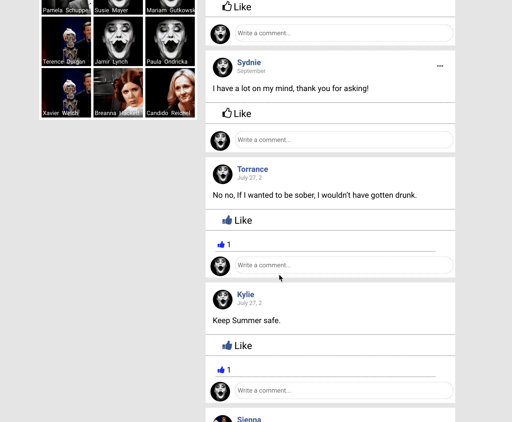
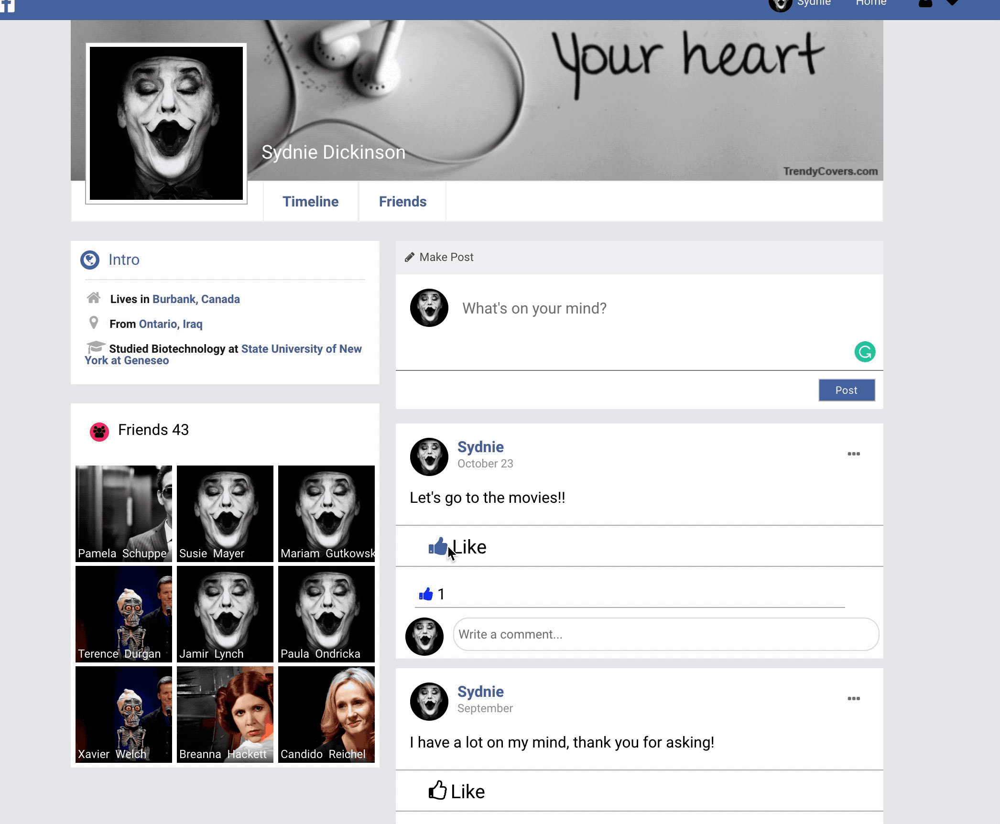
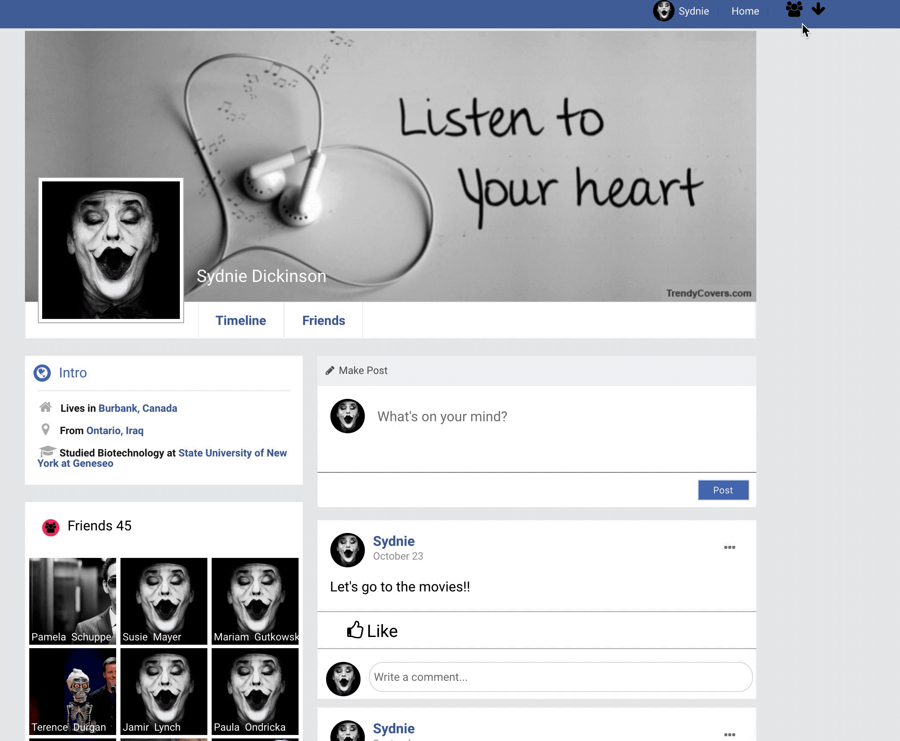
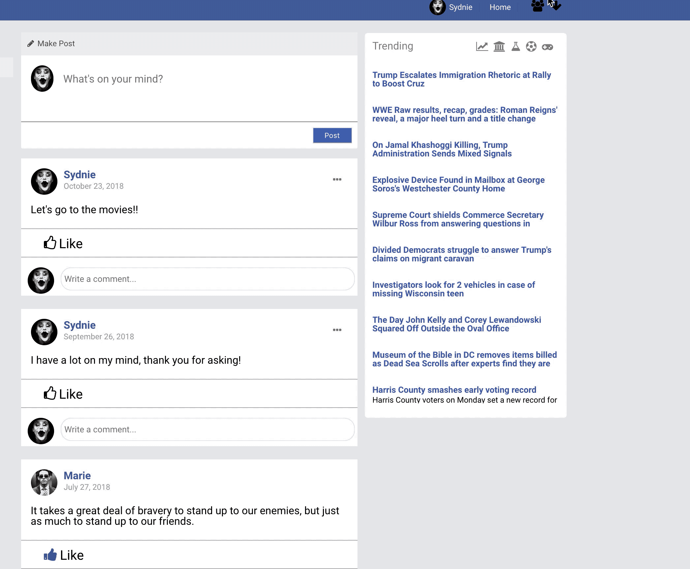
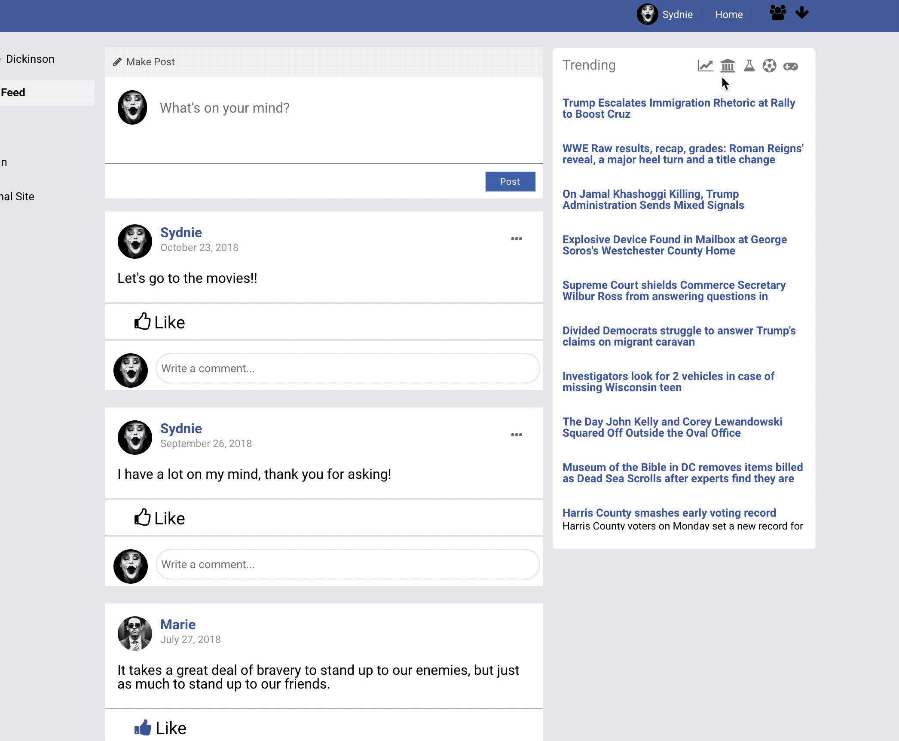

# Socialbook

Please check out the site at [Socialbook](http://www.socialbook.tech)

Socialbook is a Facebook clone that seeks to replicate some commonly used features and design decisions as closely as possible. Socialbook enables users to interact with others in their social network by adding and removing friends, posting, writing on their friends walls, commenting on their posts and friends posts, and keeping track of other interactions via their newsfeed.

## Technology

### Frontend

- React
- Redux
- AJAX
- CSS
- Sass/SCSS
- Node/NPM

### Backend

- Ruby on Rails
- Heroku (web hosting)
- Amazon Web Services (S3)
- PostgreSQL
- ActiveRecord

## Features

A gif will be present below each description showing each feature in action.

1. Custom Authentication
2. CRUD Post
3. CRUD Comment
4. Post Like
5. Uploading Image
6. Adding/Deleting a Friend
7. Newsfeed
8. Pending Friend Request
9. News API

### Custom Authentication

Most users when using a social media platform expect the company to maintain a high level of optional privacy and security. In order to make sure the security portion meets customer standards, I used BCrypt gem. The gem makes sure what gets saved is a hash version of the password instead of the password itself.

Error handling was implemented in order to convey to the user what he/she is missing. The process happens once a person clicks on Login/Create Account button. As errors start to trigger due to failed validations, we pass those errors in the error slice of state. Depending on the type of error, we can allocate them in the right location.


### CRUD (Create, Read, Update, Delete) Post

A Logged in user will be able to Create a Post in two different locations. First would be on their Newsfeed and second is in their profile page. By creating one in either location, it'll show up in both of them. A user who didn't create the post will only be able to Read the post. Those with authority will be able to view a drop down button which will have both Edit/Delete functionality availble. The function which checks if a user has such functionality is as follow:

```Javascript
  postOwner(post) {
    if (post.owner === this.props.currentUser.id) {
      return (
        <div>
          <DropDown
            deletePost={this.props.deletePost}
            post={post}
            currentUser={this.props.currentUser}
            user={this.props.user}
            updatePost={this.props.updatePost}
          />
        </div>
      );
    }
  }
```

Here, the Post has a owner key which points to the creator ID. We compare it to the currentUser (Logged in user) ID and if a match was to appear then he/she may be able to edit or delete their post.


### CRUD (Create, Read, Update, Delete) Comment

A Comment is created in reponse to a Post created by either the current user or an individual he/she is friends with. Much similar to Post, a comment can only be Edited/Deleted by the individual who created it. This convention is much similar to CRUD Post although the difference is, a comment can't be created without having the Post Id present. When Posts are retrieved, a slice of state with comments is created where the Post Id (key) points to an array of comments.

```Javascript
  case RECEIVE_POST:
    newState = merge({}, state);
    let post = action.post;
    if (post) {
      newState[post.id] = post.comments.array
        ? post.comments.array
        : post.comments;
    }
    return newState;
```

By having the Post ID be the key that point to a collection of comments, we are able to look up the Post Id at o(1) time and pass in the collection of comments array to the Comment List component which will return a collection of converted data into li html element which we then place under the post.

```JavaScript
  commentList = commentList.map(comment => {
    return (
      <div className="comment-list" key={`${comment.id}`}>
        <div className="comment-container">
          
          <div className="comment-content">
            <Link
              className="comment-owner-name"
              to={`/users/${comment.user.id}`}
              replace
            >
              {comment.user.first_name}
            </Link>
            <span>{comment.text}</span>
          </div>
          {this.commentOwner(comment)}
        </div>
      </div>
    );
  });
```



### Liking A Post

A user when logged in will have two options, they can either Like (create) or Unlike (delete) a Post. This functionality has always been important to Facebook as it gives users a way to express how they feel about a post created by other individuals they are either following or friends with. In order to know whether a user can like or dislike a post a check is done to see if the userId is present within the collection of users who has already liked the post.

```JavaScript
    if (this.props.likeIds.includes(this.props.userId)) {
      return (
        <div className="like-container">
          <div className="liked" onClick={this.unlike.bind(this)}>
            <i className="fa fa-thumbs-up" /> <span>Like</span>
          </div>
        </div>
      );
    } else {
      return (
        <div className="like-container">
          <div className="like" onClick={this.like.bind(this)}>
            <i className="fa fa-thumbs-o-up" /> <span>Like</span>
          </div>
        </div>
      );
    }
```

Currently, the search for a user is done in o(n) time which isn't bad but can be improved with minor modification to how information is being recieved. The search look up time can be further improved by saving the userId as a key. By uterlizing a Hash Table instead of an Array we can use it's o(1) look up speed to further optomize the application.



### Uploading image

A user is able to update their profile image. The process is similar to Facebook where a user selects an image and it produces a preview before the user saves their image. If he/she were to cancel the image, it would disappear from the local state and they'll need to pick an image again.


### Adding/Deleting Friends

The interaction between two users starts from the backend. Upon requesting to add a user, a friendship is initialized through the Friends model. The user who initiates the request is considered a friender while the requested is the friendee. By default once the instance has been initialized it'll have a default "Pending" until a friendee accepts the requested friendship.

```Ruby
create_table "friends", force: :cascade do |t|
  t.integer "friender_id", null: false
  t.string "status", default: "Pending", null: false
  t.datetime "created_at", null: false
  t.datetime "updated_at", null: false
  t.integer "friendee_id"
  t.index ["friendee_id"], name: "index_friends_on_friendee_id"
  t.index ["friender_id"], name: "index_friends_on_friender_id"
end
```

There were multiple ways a developer could have created a "friend" connection. An example would have been to create two models, a pending and friendship. Such role would have separated the task to it's respective model. I believe my approach kept things simpler since any negative actions such as "cancel of request" or "deleting a friend" would result in just removing that single initialized instance instead of possible two.



### Newsfeed

The Newsfeed is one of Facebook's key feature. A NewsFeed is where a logged in user gets to see what their friends have posted and is able to make a post (which appears on their profile wall as well).

```Ruby
def newsfeed
  @friends ||= self.in_friends.where("friends.status = 'Accepted'").includes(:posts) + self.out_friends.where("friends.status = 'Accepted'").includes(:posts)
  @something = self.profile_posts

  @posts = []

  @friends.each { |friend| @posts += friend.posts }
  @newsfeed = @posts + @something

  @newsfeed.sort! { |a, b|  b.created_at <=> a.created_at }
end
```

Since the interaction between a "friend" can either be the initiator (in_friends/friender shown on top snippet) or the receiver (out_friends/friendee shown on top snippet), we needed to grab all the friends the current user is associated with while he/she is either a (friender/friendee) and with a "Accepted" status which means they are friends.


### Pending User Requests

When another user decides to request permission to become friends, a request is send and turns to pending until the reciever decides to become mutual friends with the indiviaul. Such action can be seen on the bottom GIF, as a user checks the current pending requests and decides to add only an individual they know. Once added, the table will turn to "Accepted" from the default "Pending" and make a mutual connection between the two users.

When a new request is created by an individual to become friends with another user, a table is created with a default "Pending" status. Should the other user approve of the request, it'll turn the created data status to "Accepted". Accepted is used in order to retrieve all users which are considered a friend to each individual. If they are yet to be a friend, the request method is run when a user logs in.

```Ruby
  def requests
    @friend_requests ||= self.requestee.where(status: "Pending")
    requesters = []

    @friend_requests.each do |friend_request|
      user = User.find(friend_request.friender_id)
      requesters.push(user)
    end
    requesters
  end
```

A user has pending request if his/her ID matches the requestee_id and status is "Pending". The collection of requested users are send to the front end and listed in the drop down box. Should a user accept, the user gets attended to the collection of friends and Pending Request dropdown gets updated with only users who has "Pending".



### News API

The api picked for implementation was www.newsapi.com. Each tab within the news component fetches new data depending on the type of news an individual is searching for. The current options are General News, Science, Sport, Technology, and Business. The tabs each has a function assigned to it which gets called once an individual clicks on it. The action takes place as follows: User clicks Business icon which has fetchBusinessNews() function attached to it, it'll make an ajax call to the api server and return the news we require to populate the page. An example of the function and the news within the application is shown below.

```Javascript
  fetchNews() {
    this.props.fetchNews();
  }

  fetchBusinessNews() {
    this.props.fetchBusinessNews();
  }

  fetchScienceNews() {
    this.props.fetchScienceNews();
  }

  fetchSportNews() {
    this.props.fetchSportNews();
  }

  fetchTechnologyNews() {
    this.props.fetchTechnologyNews();
  }
```



## Design Decisions

#### Why React?

React was created by the Facebook 2013, a library that has become popular in the last year. Question: why React was implemented over it's well known competitor Angular? Besides the most obvious point that Facebook uses it, React has a lot of good reasons why one may pick it over its competitors. First is its size. Being a small library and not a framework like Angular, it makes it faster for a user visiting a website to download the required files quicker. Another advantage is how quick React runs due to its use of a virtual DOM that updates depending on changes occurring in comparison to using views (Angular).

## Features in Development

- Fix drop down regarding pending Users - DONE
- Friends add state not updating and delete button - DONE
- Implement Comment to Posts - DONE
- Editing Posts and Comments - DONE
- Improved Newsfeed algorithm
- Search for Users
- Suggested Friends
- Add like to Comments
- Include Websockets
